# Ferrari Webpage 🏎
Este proyecto fue realizado en el trayecto del curso de Programación Web de la academia digital Coderhouse.
 La idea siempre fue realizar una página web que sea atractiva visualmente, pero que a la vez pueda transmitir información que le pueda servir al usuario que entra a la página, para esto, me iba a valer mucho del uso de imágenes e infografías.
 Durante el trayecto de la creación del sitio web el diseño fue mutando hacia lo que fue la versión final, proceso que dejé reflejado en las siguientes capturas de pantalla.
 ### Wireframe inicial Index
 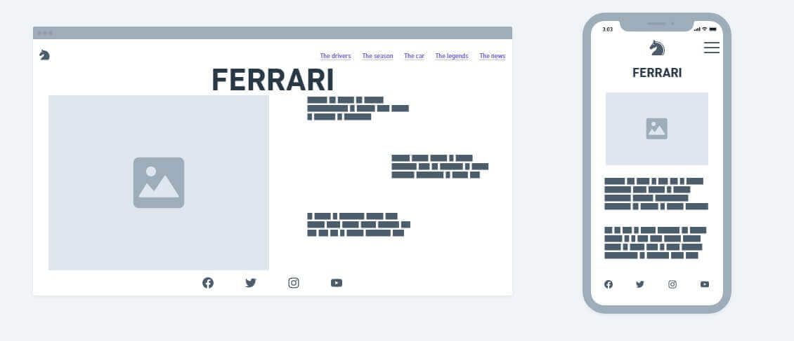
 ### Versión final Index
 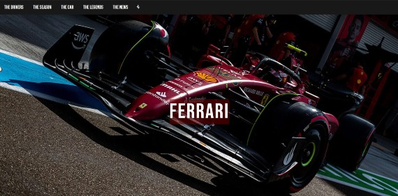
 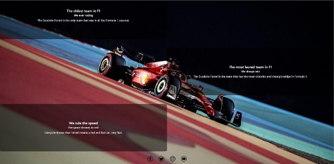
 ### Wireframe inicial Drivers
 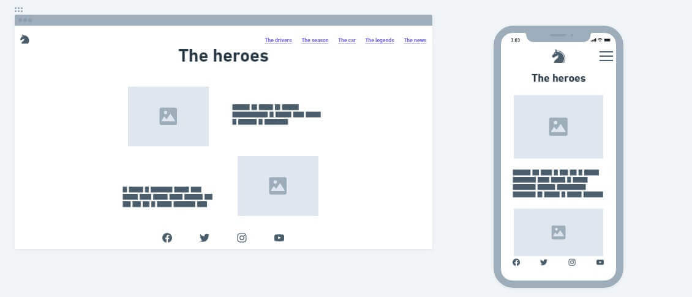
 ### Versión final Drivers
 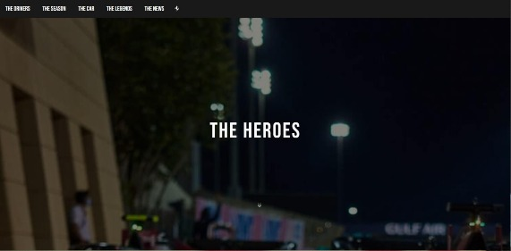
 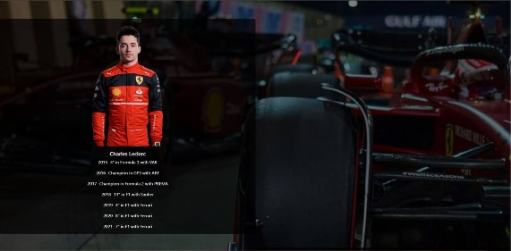
 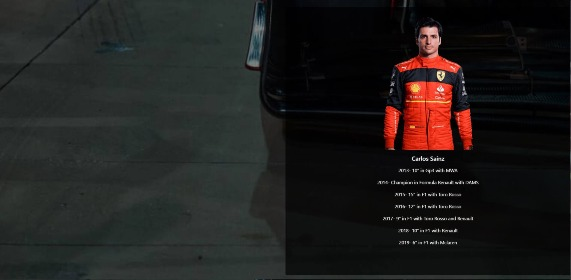
  ### Wireframe inicial Season
 
 ### Versión final Season
 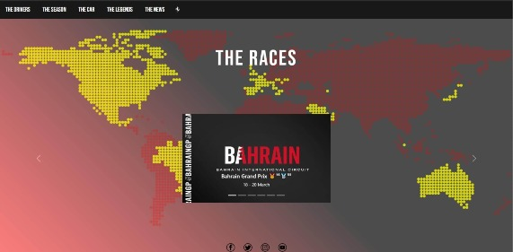
  ### Wireframe inicial Car
 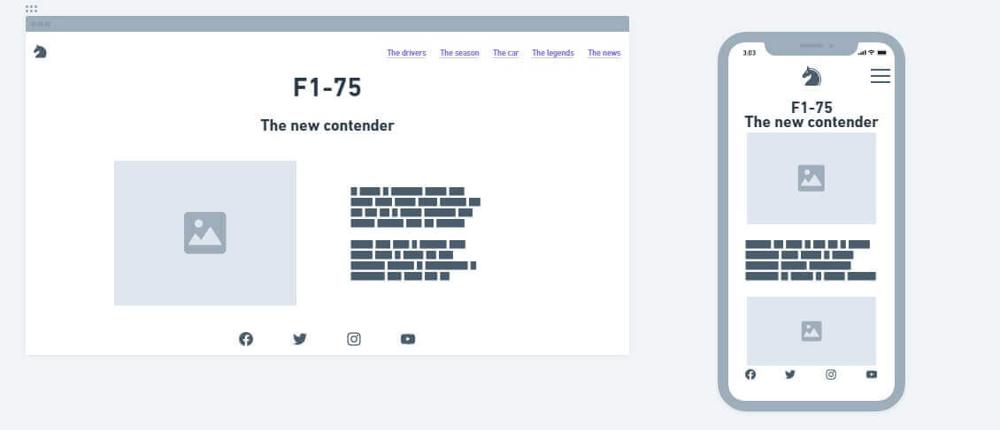
 ### Versión final Car
 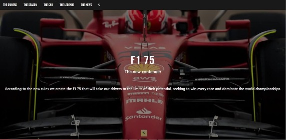
 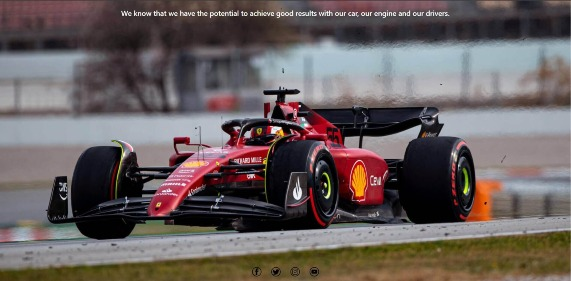
  ### Wireframe inicial Legends
 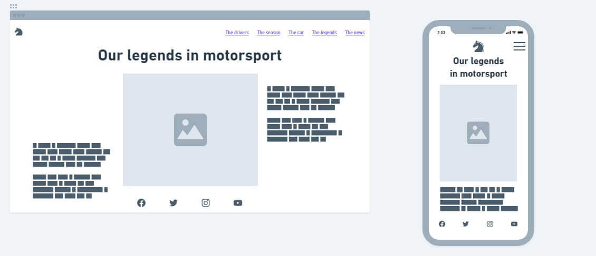
 ### Versión final Legends
 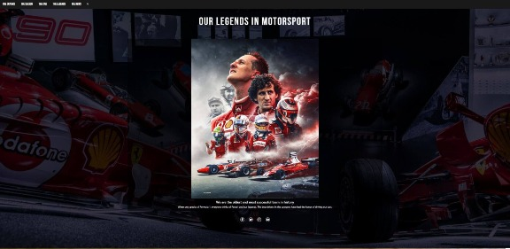
  ### Wireframe inicial News
 
 ### Versión final News
 
 
 ## Tecnologías que usé a lo largo del proyecto 💻
 En principio todo el maquetado fue en HTML, y los estilos se los dí con CSS. Pero a medida que fui avanzando en el aprendizaje, la organización del contenido pasó a manos de Flexbox, Grids y Bootstrap y los estilos a SASS.
 
 A pesar de que tenía conocimiento previo en Html y Css poder realizar este trayecto educativo y finalizarlo con este proyecto me hizo aprender mucho y disfrutar del diseño y desarrollo web.